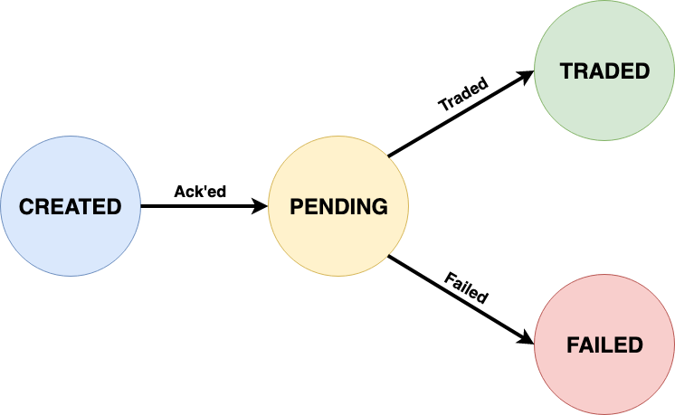

# @eamodeorubio <!-- .element: style="color: yellow;text-transform: none" -->

<a href="https://www.contentful.com/" rel="nofollow" target="_blank"></a>


# Typing like a <span style="color: #294E80">Pro</span>
### (<span style="font-weight: lighter;">with</span> )


## Why a Type System?


### Not only IDE help


### Also Correctness
#### (build/assign the right data)

```typescript
              const john = {                     const john: PersonalInfo = {
                name: 'John',                      name: 'John',
                age: -30,             VS.          age: 30,
                heigth: 176                        height: 176
              }                                  }
```


### More important, readability
#### (express what your code expects)

```javascript
// How do I use this method?
function savePersonalInfo(personalInfo)
```

VS.

```typescript
interface PersonalInfo {
  name: string
  age: number
  height: number
}

function savePersonalInfo(data: PersonalInfo): Promise<void>
```


### And removing boilerplate tests

```javascript
describe('savePersonalInfo', () => {
  // Boilerplate, low value
  describe('validates input', () => {
    // check null, fields, etc...
  })
  it('returns a promise', () => {
    // Really?
  })
  describe('saves the data!', () => {
    //...Now I can write the tests that I'm interested in
  })
})
```


### Types gives a <em><span style="color: green">faster</span></em> feedback loop!
#### By detecting <span style="color: red">silly mistakes</span> <em>as we type</em>
#### And <em>removing</em> the need of some <span style="color: red">low value</span> tests 


## A trading bot!


### Order Lifecycle




### Orders

* The market takes time to trade orders
* Some orders can be `failed` because:
  * The trade was not done after some specified time
  * They contained some error, like bad stock symbol
* Keep track of the "broker" `orderId` for further reference
* Two kinds: <em>purchase</em> & <em>sell</em>


### Purchase order
#### Creation

* Which `stock` to buy
* Maximum price the bot is willing to pay
* Maximum quantity the bot is willing to buy


### Purchase order
#### Success

* What was the actual purchase price
* How many shares were actually puchased


### Sell order
#### Creation

* Which `stock` to sell
* Minimum sell price
* Minimum quantity the bot is willing to sell


### Sell order
#### Success

* What was the actual sell price
* How many shares were actually sold


### What's in an order?

| Type     | Created | Pending | Failed | Traded |
| ---:      | :---:     | :---:    | :---:    | :---: |
| Purchase | `stock`, `maxPrice`, `maxQuantity` | +`brokerId` | +`error` | +`puchasePrice`, +`unitsPurchased` |
| Sell | `stock`, `minPrice`, `minQuantity`, `maxQuantity` | +`brokerId` | +`error` | +`sellPrice`, +`unitsSold` |


## Naïve approach
#### (Use  like old Java)


### Start with a purchase
#### Add data from created state

```typescript
interface PurchaseOrder {
  stock: string
  maxPrice: number
  maxQuantity: number
}
```


### Add data from the pending

```typescript
interface PurchaseOrder {
  stock: string
  maxPrice: number
  maxQuantity: number
  // For pending
  brokerId: string
}
```


### There is also an error state

```typescript
interface PurchaseOrder {
  stock: string
  maxPrice: number
  maxQuantity: number
  // For pending
  brokerId: string
  // For failed
  errorMsg: string
}
```


### And success

```typescript
interface PurchaseOrder {
  stock: string
  maxPrice: number
  maxQuantity: number
  // For pending
  brokerId: string
  // For failed
  errorMsg: string
  // For success
  purchasePrice: number
  unitsPurchased: number
}
```


### Orders are in one state at a time

```typescript
interface PurchaseOrder {
  stock: string
  maxPrice: number
  maxQuantity: number
  // For pending
  brokerId?: string
  // For failed
  errorMsg?: string
  // For traded
  purchasePrice?: number
  unitsPurchased?: number
}
```


### Which state is the order in?

```typescript
enum OrderStatus {
  CREATED,
  PENDING,
  FAILED,
  TRADED
}
```


### Which state is the order in?

```typescript
interface PurchaseOrder {
  status: OrderStatus
  stock: string
  maxPrice: number
  maxQuantity: number
  // For pending
  brokerId?: string
  // For failed
  errorMsg?: string
  // For traded
  purchasePrice?: number
  unitsPurchased?: number
}
```


### But there can be two kind of orders

```typescript
enum OrderKind {
  PURCHASE,
  SELL
}
```


### Purchase and sell orders have different data for some states

```typescript
interface Order {
  kind: OrderKind
  status: OrderStatus
  stock: string
  minPrice?: number
  maxPrice?: number
  minQuantity?: number
  maxQuantity?: number
  brokerId?: string
  errorMsg?: string
  sellPrice?: number
  purchasePrice?: number
  unitsPurchased?: number
  unitsSold?: number
}
```


### Non-sense order

```typescript
// No compiler complains
// Do you get some IDE help here?
const nonSensicalOrder: Order = {
  kind: OrderKind.PURCHASE,
  status: OrderStatus.TRADED,
  stock: 'CodeMotion',
  errorMsg: 'not traded',
  purchasePrice: 300,
  unitsSold: 49
}
```


### This is the help from your IDE


### Same, same with broker messages

```typescript
interface BrokerMsg {
  brokerId: string
  errorMsg?: string
  sellPrice?: number
  purchasePrice?: number
  unitsPurchased?: number
  unitsSold?: number
}
```


### Order updates

```typescript
// Business logic
declare function updateOrder(current: Order, msg: BrokerMsg): Order
```


### Non-sense update

```typescript
const whoKnowsWhatIsThis: Order = updateOrder(
  nonSensicalOrder,
  { brokerId: '1', sellPrice: 1000 } // Non-sensical broker msg
)
// What we just did here?
```


### Another non-sense update

```typescript
// Arguments correct, but:
// * Cannot trade a non-pending order! It is not yet in the broker
// * Cannot apply a successful sell to a purchase order
const whoKnowsWhatIsThis: Order = updateOrder(
  aCorrectJustCreatedPurchaseOrder,
  aCorrectSuccessfulSellBrokerMsg
)
// Should we throw or what?
```


### A correct update... 
#### ...but we don't know anything of the result!

```typescript
// Whe know it's a successful purchase by the name.
// But the compiler does not know and cannot help us!
const successfulPurchase: Order = updateOrder(
  aCorrectPendingPurchaseOrder,
  aCorrectSuccessfulPurchaseBrokerMsg
)
```


### Is  useful after all?

```javascript
// Is it much more safer than plain JS?
// Note that plain JS is cheaper, no need to write types!
const nonSensicalOrder = {
  kind: PURCHASE,
  status: TRADED,
  stock: 'CodeMotion',
  errorMsg: 'not traded',
  purchasePrice: 300,
  unitsSold: 49
}

const nonSensicalBrokerMsg = { brokerId: '1', sellPrice: 1000 }

const whoKnowsWhatIsThis = updateOrder(nonSensicalOrder, nonSensicalBrokerMsg)
```


# 🤔 💣
# 🙈 😕


## Leveraging  type system
#### (Use  like a <span style="color: #294E80">Pro</span>)


### Discrimated unions
#### Example: Result type

```typescript
interface Failure {
  ok: false // Single values are also types!
  error: string
}

interface Result {
  ok: true
  data: any
}

type Result = Ok | Failure
```


### Discrimated unions
#### Type refinement

```typescript
declare function update(sql: UpdateSQL): Result;

const updated = update(makUsersAbove18AsLegalAge);

if(updated.ok) {
  // Here TS knows that updated.result exists
  if(updated.data > 0) { // Fails, updated.data type is any!
    // Even if it were not to fail
    // ok.data may not be a number as we thought
    console.log(`Updated ${ok.data} users`)
  } else {
    console.log('No rows updated')
  }
} else {
  // Here TS knows that updated.error exists and it's a string
  console.log(`Something went wrong: ${ok.error}`)
}
```


### Parametric Types (a.k.a. Generics)
#### Functions that take types and return types

```typescript
// "Ok" now takes another type R and returns a new Type
interface Ok<R> {
  ok: true
  data: R
}

// So "Result" must take a parameter type also
type Result<R> = Ok<R> | Failure
```


### Parametric Types (a.k.a. Generics)

```typescript
declare function update(sql: UpdateSQL): Result<number>;

const updated = update(makUsersAbove18AsLegalAge)

// All safe now, the IDE will help us also
if(updated.ok) {
  if(updated.data > 0) {
    console.log(`Updated ${ok.data} users`)
  } else {
    console.log('No rows updated')
  }
} else {
  console.log(`Something went wrong: ${ok.error}`)
}
```


### Conditional Types
#### If this <span style="color: yellow">type</span> then that <span style="color: green">type</span>

```typescript
enum EventKind {
  LOGIN,
  LOGIN_SUCCESS,
  // More types...
}

interface LoginData {
  username: string
  password: string
}

interface LoginSuccessData {
  token: string
}
```


### Conditional Types
#### If this <span style="color: yellow">type</span> then that <span style="color: green">type</span>

```typescript
type DataForEventOf<K extends EventKind> =
  K extends EventKind.LOGIN ? LoginData :
  K extends EventKind.LOGIN_SUCCESS ? LoginData :
  // ... K extends EventKind.OTHER_KIND ? LoginData :
  never

type Event<K extends EventKind> = { kind: K } & DataForEventOfKind<K>  

declare function dispatch<K extends EventKind>(
  eventKind: K,
  data: DataForEventOfKind<K>
): Promise<void>;

// Safe & IDE help
dispatch(EventKind.LOGIN_SUCCESS, {
  token: '8012466df09f6c6a7a6a2b7df41e355489dff0a3'
})
```


### Back to the orders!

* The data in an order depends on two things
  * The order kind (sell vs. purchase) determines initial details
  * The status (created, pending, failed, traded) determines the current state data


### Order(Kind, Status) = Details(Kind) + State(Status)

```typescript
type Order<K extends OrderKind, S extends OrderStatus> = {
  details: OrderDetails<K>
  state: OrderState<S> 
}
```


### Details(Kind)

```typescript
interface PurchaseOrderDetails {
  kind: OrderKind.PURCHASE
  stock: string
  maxPrice: number
  maxQuantity: number
}

interface SellOrderDetails {
  kind: OrderKind.SELL
  stock: string
  minPrice: number
  minQuantity: number
  maxQuantity: number
}

type OrderDetails<O extends OrderKind> =
  O extends OrderKind.PURCHASE ? PurchaseOrderDetails :
  O extends OrderKind.SELL ? SellOrderDetails :
  never
```


### State(Status)

```typescript
interface OrderCreated {
  status: OrderStatus.CREATED
}
interface OrderPending {
  status: OrderStatus.PENDING
  brokerId: string
}
interface OrderFailed {
  status: OrderStatus.FAILED
  brokerId: string
  errorMsg: string
}
interface OrderTraded {
  status: OrderStatus.TRADED
  brokerId: string
  sellPrice?: number // Ooops, those `?` again!!
  purchasePrice?: number
  unitsPurchased?: number
  unitsSold?: number
}
```


### State(Status, Kind)
#### Better

```typescript
interface PurchaseOrderTraded {
  status: OrderStatus.TRADED
  brokerId: string
  purchasePrice: number
  unitsPurchased: number
}

interface SellOrderTraded {
  status: OrderStatus.TRADED
  brokerId: string
  sellPrice: number
  unitsSold: number
}

type OrderTraded<K extends OrderKind> =
  K extends OrderKind.PURCHASE ? PurchaseOrderTraded :
  K extends OrderKind.SELL ? SellOrderTraded :
  never
```


### Order(Kind, Status) = Details(Kind) + State(Status, Kind)

```typescript
type OrderState<S extends OrderStatus, K extends OrderKind> =
  S extends OrderStatus.CREATED ? OrderCreated :
  S extends OrderStatus.PENDING ? OrderPending :
  S extends OrderStatus.FAILED ? OrderFailed :
  S extends OrderStatus.TRADED ? OrderTraded<K> :
  never

type Order<K extends OrderKind, S extends OrderStatus> = {
  details: OrderDetails<K>
  state: OrderState<S, K> 
}
```


### Broker messages

```typescript
interface Acked {
  brokerId: string
}
interface Failed {
  errorMsg: string
}
interface Purchased {
  purchasePrice: number
  unitsPurchased: number
}
interface Sold {
  sellPrice: number
  unitsSold: number
}
type Traded<K extends OrderKind> = 
  K extends OrderKind.PURCHASE ? Purchased :
  K extends OrderKind.SELL ? Sold :
  never
type BrokerEvent<K extends OrderKind> = Acked | Failed | Traded<K>
```


## But now, broker messages and states have duplicated fields
### Need to refactor somehow 🤔


### DRY Messages & States
#### Intersection types!

```typescript
type OrderPending =
  { status: OrderStatus.PENDING } & Acked

type OrderFailed =
  { status: OrderStatus.FAILED } & Acked & Failed

type PurchaseOrderTraded =
  { status: OrderStatus.TRADED } & Acked & Traded<OrderKind.PURCHASE>

type SellOrderTraded =
  { status: OrderStatus.TRADED} & Acked & Traded<OrderKind.SELL>
```


### Creating orders

```typescript
// Type safe, IDE help, non-verbose factory functions
// Note D['kind']
declare function createOrder<
  K extends OrderKind,
  D extends OrderDetails<K>
>(
  details: D
): Order<D['kind'], OrderStatus.CREATED>
```


### Business logic

```typescript
declare function acceptOrder<K extends OrderKind>(
  order: Order<K, OrderStatus.CREATED>,
  event: Acked
): Order<K, OrderStatus.PENDING>;

declare function rejectOrder<K extends OrderKind>(
  order: Order<K, OrderStatus.PENDING>,
  event: Failed
): Order<K, OrderStatus.FAILED>;

declare function fulfilOrder<K extends OrderKind>(
  order: Order<K, OrderStatus.CREATED>,
  event: Traded<K>
): Order<K, OrderStatus.PENDING>;
```


### IDE Help
#### Try at home!

```typescript
const newSell = createOrder({
  kind: OrderKind.SELL,
  minQuantity: 4,
  maxQuantity: 10,
  minPrice: 300,
  stock: 'UTF'
})

const acceptedSell = acceptOrder(newSell, {
  brokerId: '1'
})

const successfulSell = fulfilOrder(acceptedSell, {
  unitsSold: 5,
  sellPrice: 330
})
```


##  in the Wild Frontier


## Data enters our system <em style="color: yellow">without</em>  checks!


### What's the type of data coming from JS?

```typescript
// index.ts

// This is what we export in our `pet` library
export interface Pet {
  name: string
  age: number
}

export interface PetBehaviour {
  manners: PetManners
  tricks: PetTrick[]
}

// Don't ever do this!
// This function signature is not only incorrect but unsafe!
export function train(pet: Pet): PetBehaviour {
  // ...
}
```


### Later in a JS consumer

```javascript
// third-party-user.js

import {train} from 'pet-trainer'

// This is legal JS, no TS compiler here!
const petBehaviour = train({
  name: ['Fido', 'the', 'dog'],
  age: '1y'
})
```


### What's the type of data coming from JS?

```typescript
// Really, we don't know what JS can send as an input!
export function train(pet: unknown): PetBehaviour {
  // ...
}
```


### `unknown` vs. `any`

* `unknown` is more restrictive that `any`
* `any` accepts any operation and field access
* `unknown` does not, forces us to refine the type first

```typescript
anyValue.a, anyValue[1], anyValue.trim(), anyValue() // OK

unknownValue.a, unknownValue[1], unknownValue.trim(), unknownValue() // ERRORs
```


### Type guards
#### Reusable type refinement!

```typescript
// Is it object like?
const isObject = (x: unknown): x is Record<string, any> =>
  typeof x === 'object' &&
  x !== null

export interface Pet {
  name: string
  age: number
}

// Is it a pet?
export const isPet = (x: unknown): x is Pet =>
  isObject(x) &&
  typeof x.name === 'string' &&
  typeof x.age === 'number'
```


### Explicitly separate the core logic

```typescript
// index.ts

// Real implementation hidden in another module
import { Pet, isPet, ops } from './core'

// This is what consumer code sees
export function train(pet: unknown): PetBehaviour {
  if(isPet(pet)) {
    return ops.train(pet) // ops.train(pet: Pet): PetBehaviour
  }
  throw new Error('That is not a pet')
}
```


### Better experience for TS users

```typescript
import { Pet, isPet, ops } from './model'

// Overload will help IDE to give TS consumers hints
export function train(pet: Pet): boolean;
export function train(pet: unknown): never; // never -> it will throw
export function train(pet: unknown): PetBehaviour {
  if(isPet(pet)) {
    return ops.train(pet) // ops.train(pet: Pet): PetBehaviour
  }
  throw new Error('That is not a pet')
}
```


### What about HTTP servers?


```typescript
// http/routes/train.ts
import { Pet, isPet, ops } from '../../core'
import { errorTracker } from 'famous-error-tracker'
import { db } from '../../db'

export function mount(router: Router): void {
  router.put('/train', async ctx => {
    const pet: unknown = ctx.request.body
    if(!isPet(pet)) {
      ctx.response.status = 400
      return
    }
    const newBehaviour = ops.train(pet)
    const dbResult = await db.save(newBehaviour)
    if(!dbResult.ok) {
      errorTracker.error(dbResult.error)
      ctx.response.status = 500
      return 
    }
    ctx.response.status = 200
    ctx.response.body = newBehaviour
  })
}
```


### Sanitization

* Type guards must always take `unknown` as input
* Provide type guards for all the types that represent inputs
* Any published function in a library must only take `unknown` inputs 
* Any function reading data (db, files, http routes, etc) must check it using type guards
* Give a nice experience to TS users by providing overloads in the public API


## There is more in !
### Index types, Mapped types, type assertions, etc.


## Any time for questions??
